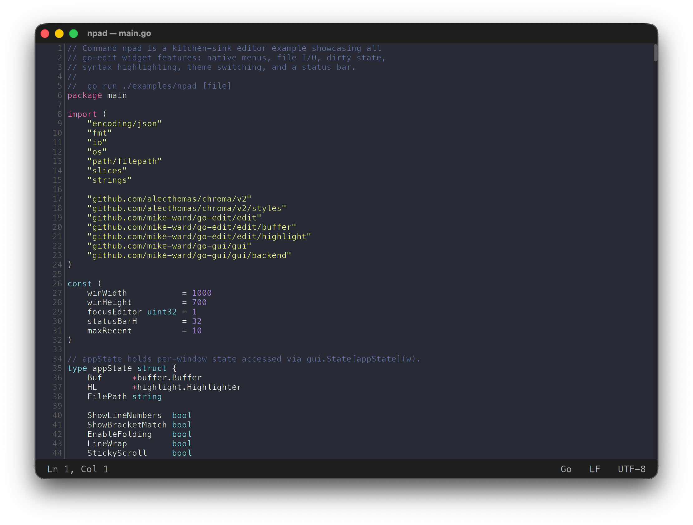

# go-edit

A code editor widget for [go-gui](https://github.com/mike-ward/go-gui). Pure Go,
no CGO. Syntax highlighting via [chroma](https://github.com/alecthomas/chroma).
Text shaping via [go-glyph](https://github.com/mike-ward/go-glyph).



*npad — the kitchen-sink example application*

---

## Features

- **Buffer** — per-line byte store; UTF-8 aware; grapheme-cluster cursor movement
- **Syntax highlighting** — chroma v2; per-line token cache; language autodetect from filename and content
- **Selection** — mouse drag, double-click word, triple-click line; Shift+arrow
- **Multi-cursor** — Alt-click to add; Ctrl+D selects next match; Escape collapses
- **Undo / redo** — linear stack; typing coalesced within 500 ms; compound-edit groups
- **Search / replace** — find bar drawn inside the canvas; literal or regex; case toggle; find-in-selection; replace all (single undo entry)
- **File I/O** — EOL detect and preserve (LF / CRLF / CR); encoding detect and round-trip (UTF-8, UTF-16 LE/BE, Latin-1, CP1252, BOM); atomic save; external-change watch; indent autodetect
- **Bracket matching** — highlight + jump; auto-close pairs
- **Code folding** — indent-based; gutter click to toggle
- **Line wrap** — toggleable; word-boundary break; cursor column math preserved across wrapped rows
- **Whitespace visualization** — spaces, tabs, EOL markers; cycles None / All / Selection
- **Sticky scroll** — pinned scope headers at viewport top; syntax-highlighted
- **Diagnostics API** — gutter markers and squiggles; callers push `DecoGutter` / `DecoSquiggle` decorations; no LSP dependency in core
- **Extension substrate** — `EditFilter` chain, `PostEditFunc` observers, `MarkSet` position tracker, `DecorationProvider` interface, layered `KeymapStack`
- **Theme** — derived from go-gui theme; per-token color overrides; chroma style bridge
- **IME** — preedit inline virtual text; candidate window anchoring via `w.IMESetRect`
- **Cursor blink** — injectable clock; separate draw canvas so blink doesn't bust the tessellation cache
- **Drag-and-drop** — file open via `OnFileDrop`
- **Accessibility** — `AccessRoleTextArea`; label and state wired to go-gui a11y tree
- **Help overlay** — F1 shows keybinding reference; scrollable; dismisses on Esc

File size limit: 32 MiB. Headless-testable; no backend required for unit tests.

---

## Usage

```go
import (
    "github.com/mike-ward/go-edit/edit"
    "github.com/mike-ward/go-edit/edit/buffer"
    "github.com/mike-ward/go-edit/edit/highlight"
)

buf := buffer.New()
hl  := highlight.New(buf, nil) // nil → autodetect language

view := edit.Editor(edit.EditorCfg{
    Buffer:          buf,
    DecoProviders:   []buffer.DecorationProvider{hl},
    ShowLineNumbers: true,
    IDFocus:         1,
})
```

`Editor` returns a `gui.View` and fits into any go-gui layout. Multiple editors
per window are supported; each is keyed by `IDFocus`.

### Running the example

```
go run ./examples/npad [file]
```

npad demonstrates native menus, file I/O, dirty-state tracking, syntax
highlighting, theme switching, and a status bar. It requires the CGO backend
(SDL2, Freetype).

---

## Architecture

```
edit/buffer/   — Buffer, Edit/Change, undo, marks, filters, decorations
edit/highlight/ — chroma DecorationProvider
edit/text/     — TextMeasurer wrapper; XForColumn / ColumnForX
edit/          — Editor factory; draw, input, amend closures; keymap; actions
edit/internal/fakewin/ — headless test fixture (deterministic measurer, event builders)
examples/npad/ — full-featured example application
```

Key design points:

- `OnDraw` has no `*Window` access. Everything the draw path needs is closed over at
  `AmendLayout` time into `*editorFrameData`.
- `DrawCanvas` is sized to the viewport; `editorState.ScrollY` owns scroll. The
  go-gui `Column(IDScroll)` mechanism is not used.
- `Buffer.Apply(Edit)` is the single mutation choke point. Filters, observers, and
  undo all route through it.
- `ID: ""` on the DrawCanvas bypasses go-gui's `(shape.ID, shape.Version)` render
  cache, which is necessary because buffer/cursor/scroll change every frame.

---

## Development

Tests run fully headless:

```
go test ./edit/...
go test -race ./edit/...
go test -bench=. -benchmem -run='^$' ./edit/buffer/
go test -fuzz=FuzzBufferApply -fuzztime=30s ./edit/buffer/
go vet ./...
golangci-lint run
```

Local development against sibling checkouts of `go-gui` and `go-glyph`: add
`replace` directives to `go.mod` pointing at `../go-gui` and `../go-glyph`.
Strip before tagging.

---

## License

MIT. See [LICENSE](LICENSE).
